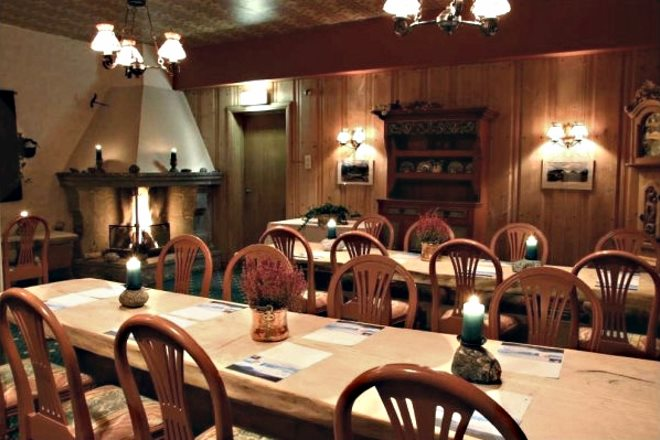
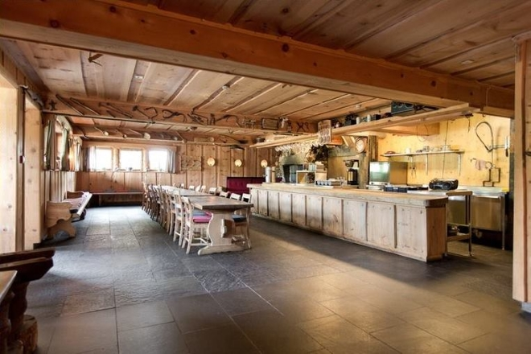
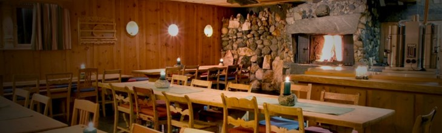

Rondane Høyfjellshotell tilbyr selskapspakker til bryllup, konfirmasjon, firmafest og lignende.

Du har to muligheter: Enten leie Erlingstugu og sørge for mat og servering selv eller betale kuvertpris for selskap i Erlingstugu eller Kristinstugu. Gjestene har flere muligheter for overnatting, enten kan de ligge på hotellet, i leilighetene over Erlingstugu eller i hyttene. Med leie av Erlingstugu følger kjøkken. I henhold til alkoholloven kan du ikke servere medbrakt alkohol selv, men denne tjenesten kan kjøpes av hotellet.

Pakke 1: Erlingstugu dagpris. Mat lages eller bringes selv i Erlingstugu: fra Kr. 2.700,-. Inkl. mva.
 Pakke 2: Erlingstugu med overnatting i leilighetene over. Mat lages på stedet eller bringes av leietager. Kr. 7600,- inkl utvask, ord. pris 9500,-. Bistand til servering av alkohol fra hotellet fra kl. 19.00 til 01.00: fra Kr. 4.700,- . Inkl. mva.

 Pakke 3: Kuvertpris med overnatting fra kr. 1.700,- i Erlingstugu eller Kristinstugu. Prisen inkluderer overnatting, tre retters middag med inntil tre glass husets vin samt frokost. Minimum 15 deltagere. Inkl. mva.

Eksempler på prispakker. Be om tilbud på andre selskapsløsninger!

<Sidefelt>

</Sidefelt>
