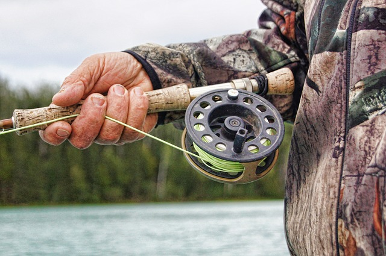

Med fiskekort fra Sel fjellstyre kan du fiske på 39 vann, et par elver, samt flere fiskeførende bekker i Rondane og Sel kommune forøvrig. Området er lett tilgjengelig, og passer for alle typer fiskere. Arter det her kan fiskes på er ørret, røye og abbor (ett vann).

[Her](https://www.sel-fjellstyre.no/fiske/sel-fjellstyre/oversikt-fiskevann) finner du en god oversikt over samtlige vann og hva slags fisk du kan forvente å få i dem.

- Sel- og Nordre Kolloen Statsallmenning byr på fiskevann som passer for alle.  De fleste av vannene ligger i Kringsæterområdet, ca 900 m.o.h. Disse er forholdsvis grunne, og varmes fort opp om sommeren.
- Det tas årlig fisk på 1-2 kg i flere av vannene. Her finner du alt fra fine familievann, til vann for den mer kresne fluefisker. Lett tilgjengelig område med fiskevann både ved vei, og kortere turer med en til to timers gange.
- Rene ørretvann finner du i den sørlige delen, med et par unntak. Ranglartjern er det eneste vannet med abbor, her er det tilrettelagt med en gapahuk. Inne på snaufjellet er det i hovedsak vann med både ørret og røye.

[Her](https://www.sel-fjellstyre.no/fiske/sel-fjellstyre/fiskekort) kan du kjøpe fiskekort.

<Sidefelt>

- Rene ørretvann finnes i den sørlige delen med et par unnntak
- Ranglartjern er det eneste vannet med Abbor
- På snaufjellet finnes både ørret og røye
- De fleste fiskevann finnes i Kringsæterområdet

</Sidefelt>
