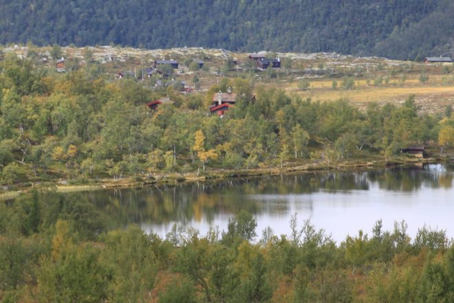

Berget rundt (4,5 km)

- Følg stien opp langs fossene og deretter blåmerket sti på østsiden av Ula ca 750 m der grønn sti leder deg opp til Bergetjønn. Gå bilveien tilbake til Rondane Høyfjellshotell.

<Sidefelt>

Turen starter opp langs Ulafossene

Bergetjønn fra stien

Ting å se & gjøre:

- Fosstur, Ula-fossene
- Bergetjønn
- Barnevennlig

</Sidefelt>
