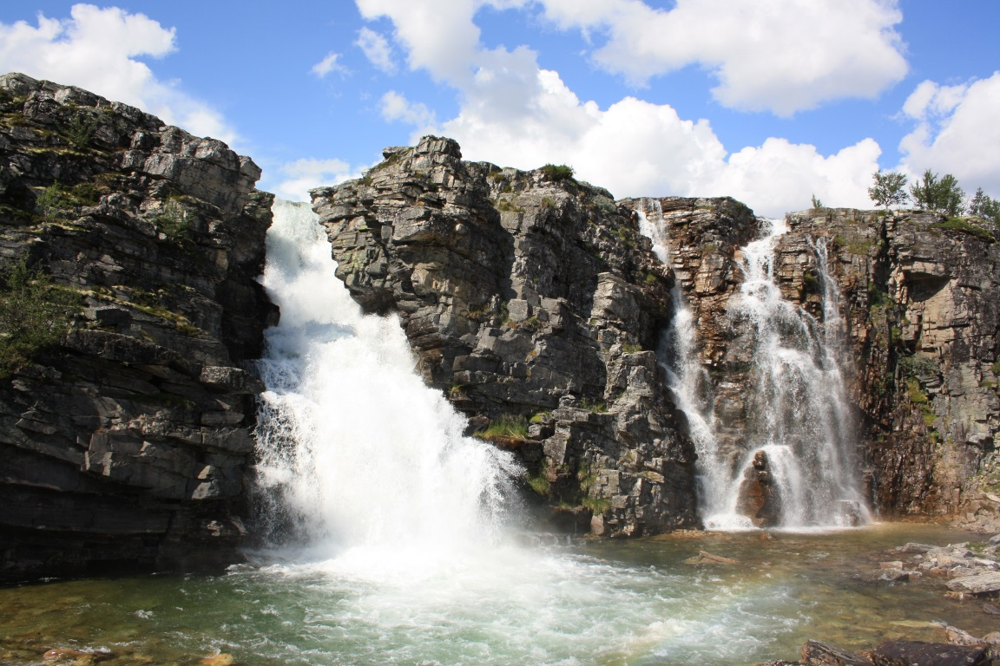

Å gå til Brudesløret anser vi som obligatorisk hvis du er gjest på Rondane Høyfjellshotell og har tid til å gå en litt lengre tur. Men her gjelder det å forberede seg litt til du skal hjem og fortelle hvor du har vært. Det er hele syv andre steder i Norge hvor noen har kalt en foss Brudesløret : Både i Geirangerfjorden, Bardu, Flora, Hongavik, Meråker, Tinn og Samnanger.

Det burde nesten vært et mål i seg selv og besøke dem alle sammen, men det er ikke det vi skal snakke om her. Det vi kan forsikre er at Brudesløret i Rondane er en av de vakreste fossene i Norge. Ta et bildesøk på Google og du vil se noen helt utrolige bilder. Det beste med Brudesløret er måten den endrer seg de ulike årstidene, og det er vanskelig å si hvilken versjon som er vakrest. Om du så besøker Brudesløret på ski, truger eller går – du blir ikke skuffet!

9km | 3t. | Moderat

- Du kommer dit ved å gå inn på samme stien du går når du går til Ulafossene (Brudesløret er en foss i den samme elva – Ula).
- Deretter følger du merket løype hele veien opp til Brudesløret (Storulfossen).
- Turen er nok ikke helt egnet for de minste barna.
- Totalt snakker vi om ni kilometer med relativt store høydeforskjeller.

5km | 2t. | Enkel

- Du kommer dit ved å kjøre til spranget med bil og parkere der.
- Deretter følger du merket løype nord-vest mot Brudesløret (Storulfossen).
- Turen er godt egnet for de minste barna. Totalt snakker vi om 5 kilometer med små høydeforskjeller.

<Sidefelt>

Fra utkikkspunktet under

 Ting å se & gjøre:

- Brudesløret
- Ulafossene
- Spranget

</Sidefelt>
