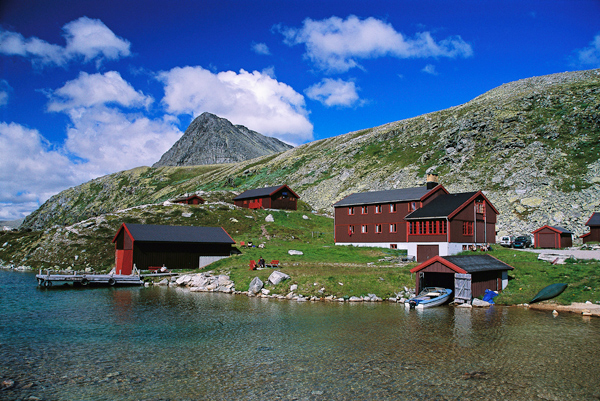
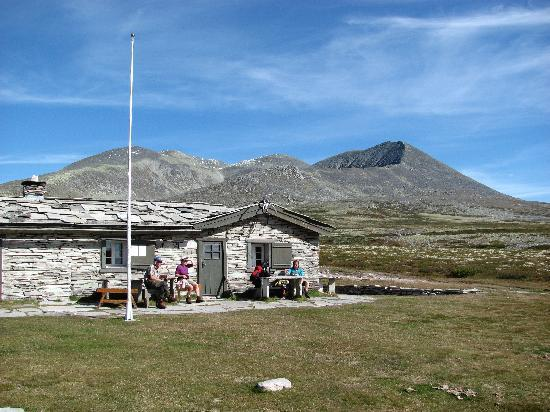

- [Fredag: Ankomst Rondane Høyfjellshotell. Avslapping i bassenget og en bedre middag.](/dokumenter/helgetur-i-rondane.pdf)

Lørdag: Rondane Høyfjellshotell - Storronden 2138 moh, retur. Åtte timer
Søndag: Rondane Høtfjellshotell - Peer Gynt-hytta og retur. Seks timer.

- Fredag

Hvis du har tid, anbefaler vi deg en lett gåtur opp langs Ulafossene og tilbake til Mysuseter bilveien. Dette er en tur som gir mye natur med lite innsats og turen tar bare én time. Deretter anbefaler vi å lade opp til helgen med en bedre middag og tur i Rondane Høyfjellshotells svømmebasseng.

- Lørdag

Lørdag morgen kan du sykle eller kjøre bil opp til Spranget. Eventuelt kan sykkelen lånes av Rondane Høyfjellshotell. Fra Spranget kan man sykle eller gå til Rondvassbu. Sykkelturen tar en halvtime eller mer, avhengig av formen.

Turen opp til Storronden er bratt og er en av de mer krevende toppturene, men er ikke spesielt krevende høydemessig og har heller ingen farlige heng. Utfordringen kan være en del stein mot toppen.  For fjellvante er dette uproblematisk, for andre gjelder det å ta seg god tid og sette foten ned på rette sted. Hvor lang tid man bruker er avhengig av form, pauser og om du sykler til Rondvassbu. Vi tror et anslag på syv-åtte timer frem og tilbake til Rondane Høyfjellshotell vil passe for de fleste, dersom du sykler. Dette er ikke en tur for de minste barna.

Begynnelsen på turen opp fjellet er relativt bratt, men lettgått. Deretter flater det noe ut, før det igjen kommer et bratt parti og en del stein. Ruta er godt merket. Rondvassbu ligger på 1167 meter og Storonden 2138 meter, altså en stigning på 971 meter.

Utsikten fra toppen er verdt de siste bestrebelsene. Såfremt det ikke er tåke vil hele Rondemassivet ligger storslått foran deg, du kan se alle de andre toppene over 2000 meter rage i terrenget. Du kan også se Snøhetta og Dovre i klart vær.

Rondvassbu er en fin stopp for lunsj før man tar turen hjem igjen. Her er det lagt opp med griller for medbragt eller man kan kjøpe mat. Rondvassbu er er eid av Den norske Turistforening.

- Søndag

Turen til Peer Gynt-hytta på lørdag går i lett myrterreng uten særlige stigninger. Du vil bruke ca. seks timer tur - tur retur inkludert en lengre matpause. Peer Gynt-hytta er åpen en del lørdager i sommerhalvåret og selger vafler.

Velger man den lette varianten tar man grusveien som starter ved Mysesæter fjellstue og følger denne innover langs et hyttefelt. Etter hvert går veien over i en sti.

Først gåt stien over et kort myrparti, deretter gjennom litt krattskog før vi kom over tregrensa- Etter dette er stien lettgått i tørt fjellterreng hele veien inn.

I området rundt Per Gynt-hytta er det bygget steinhytter, som ligger diskret til i terrenget og flere steder å sitte lunt. Steinbuene, elva, juvet og vegetasjonen er et vakkert skue. En har lett for å tenke at ”ja, dette er virkelig Norge!”

