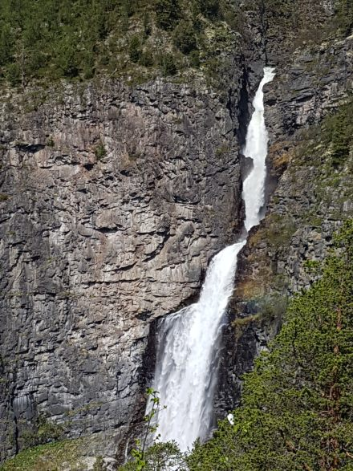
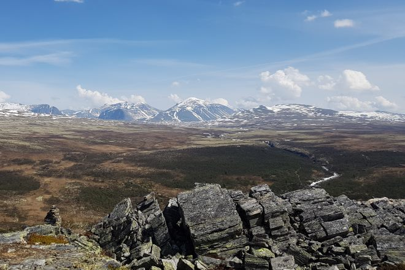

Kåsen - Vesleulfossen (Ni kilometer)

- Følg hovedveien som går forbi Rondane Høyfjellshotell omlag hundre meter, sving til venstre og følg skiltet til stien som går opp langs Ulafossene. Gå over brua. Følg deretter Peer Gynt-stien én km og ta av til venstre opp på Kåsen. Følg den gule stien ned til utsiktspunktet ved Vesleulfossen og fortsett videre bort til den rødmerkede Peer Gynt-stien, som følges tilbake til Rondane Høyfjellshotell.

Vesleulfossen har et fossefall på hele 180 meter og er med det Opplands lengste.

<Sidefelt>

Rondanes lengste fossefall fra Vesleulfossen

Kåsen gir 360° panorama over nasjonalparken og Mysuseter

Ting å se & gjøre:

- Kåsen med panoramautsikt
- Rondanes lengste fossefall

</Sidefelt>
