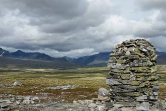

- Ranglarhø (6 km) Følg bilveien til bommen (retning Spranget) og så Hamnsetervegen. Den blå stien følger Peillen og går over Ranglarhø til Tjønnbakken. Gå veien tilbake til Rondane Høyfjellshotell.

<Sidefelt>

Flott utsikt fra toppen av Ranglarhø

Pidestal av stein brakt opp på Ranglarhø

Ting å se & gjøre:

- Ranglarhø (1130 moh)
- Tjønnbakken
- Utsiktspunkt
- Barnevennlig

</Sidefelt>
