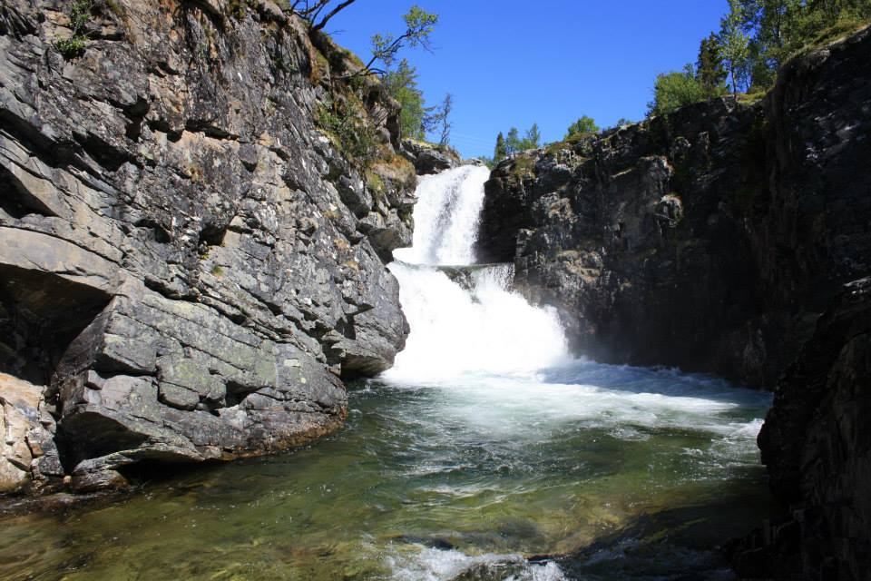
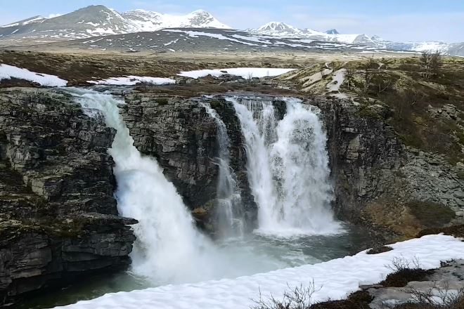

- Ulafossen - Spranget (10,5 km) Følg stien opp langs fossene og deretter blåmerket sti på østsiden av Ula opp til Spranget. På veien kan du også møte Brudesløret, en av de flotteste fossene ved ingangen av nasjonalparken. Gå hovedveien tilbake til Rondane Høyfjellshotell og Rondane Fjellstue.

<Sidefelt>

Ulafossene er hotellets nærmeste milepel

Brudesløret på vei til spranget

Ting å se & gjøre:

- På spranget kan du leie sykkel videre til Rondvassbu
- Ulafossene
- Spranget
- Brudesløret
- Rondane Fjellstue
- Røde Kors hytta
- Rondane Høyfjellshotell

</Sidefelt>
