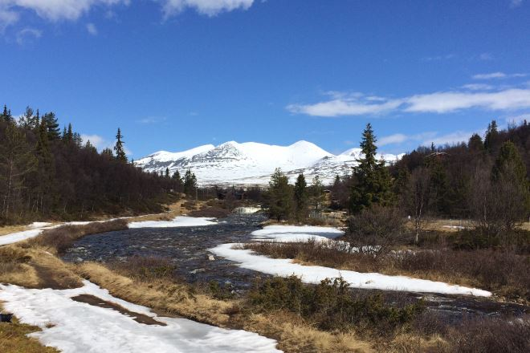
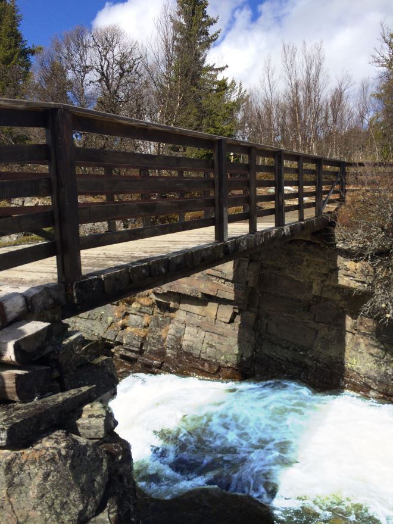

Vi skryter ofte av at Rondane Høyfjellshotell er porten til Rondane nasjonalpark. Det gjør vi fordi vi ligger nærmest av alle overnattingssteder til nasjonalparken. Men du behøver ikke gå lenger enn ti minutter fra Mysuseter, så er du ute i vill natur!

- Turen vi beskriver her tar maksimalt én time for voksne. Gå ut av Rondane Høyfjellshotell, følg asfaltveien hundre meter oppover, ta til venstre. Følg skiltet. Passér noen hytter langs en grusvei og du er fremme ved elva som heter Ula. Jo lenger du går oppover, jo større blir fossefallene.
- Vi har flere asiatiske grupper hos oss og hotellsjefen tar dem ofte ut på en liten tur langs fossen fordi de kun er på overnattingsstedet én kveld, før de reiser videre neste dag. Reaksjonen er den samme hver gang: Dette syns de er eksotisk. Det vil trolig du også synes, såfremt du ikke har en foss i ditt nabolag.
- Vi tør påstå du kan ta med bestefar på denne turen, ja endog oldefar om han får en sterk hånd å støte seg til. Gåstol? Kanskje ikke, da ville vi valgt veien, dvs motsatt vei av denne beskrivelsen - og gått nedover fossen så langt det lar seg gjøre.
- På toppen av fossen og under den broen bor det et troll. Men det skal du ikke la deg skremme av.
- Er dere en større gruppe? Ta gjerne kontakt med Rondane Høyfjellshotell, så kan vi arrangere lunsj oppe ved brua!
- Går du 200 meter lenger oppover langs elva ser du Rondane i all sin prakt med snøkledde Smiubelgen rett foran deg. Lenger behøver du ikke gå for å få en fin naturopplevelse.
- Vi anbefaler å gå veien ned igjen. Kryss broen igjen og gå inn på grusveien. Du passerer en del hytter og kommer til Mysyseter fjellstue, deretter Røde Kors hytta.
- Litt etter, til venstre ser du alpinbakken og snart kommer du til Mysuseter servicesenter, hvor du kan ta en kopp kaffe før du kommer til Rondane Høyfjellshotell ca. 400 meter lenger nede.
- Ikke en slitsom tur. Denne turen er så godt som designet for en japaner med lakksko og slips.

<Sidefelt>

Smiubelgen og Rondane nasjonalpark i det fjerne.

Under denne brua bor det et troll.

</Sidefelt>
