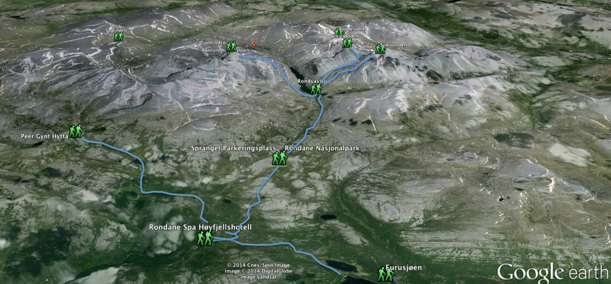
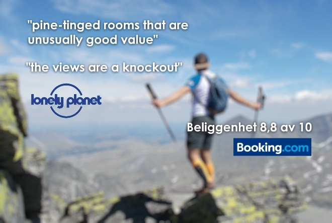
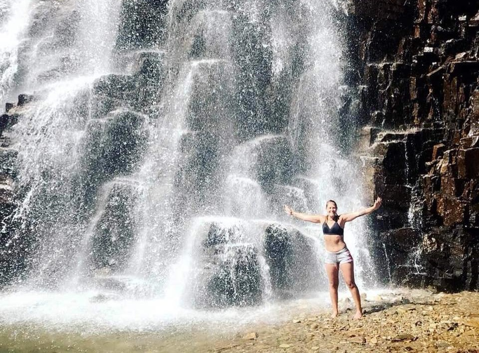
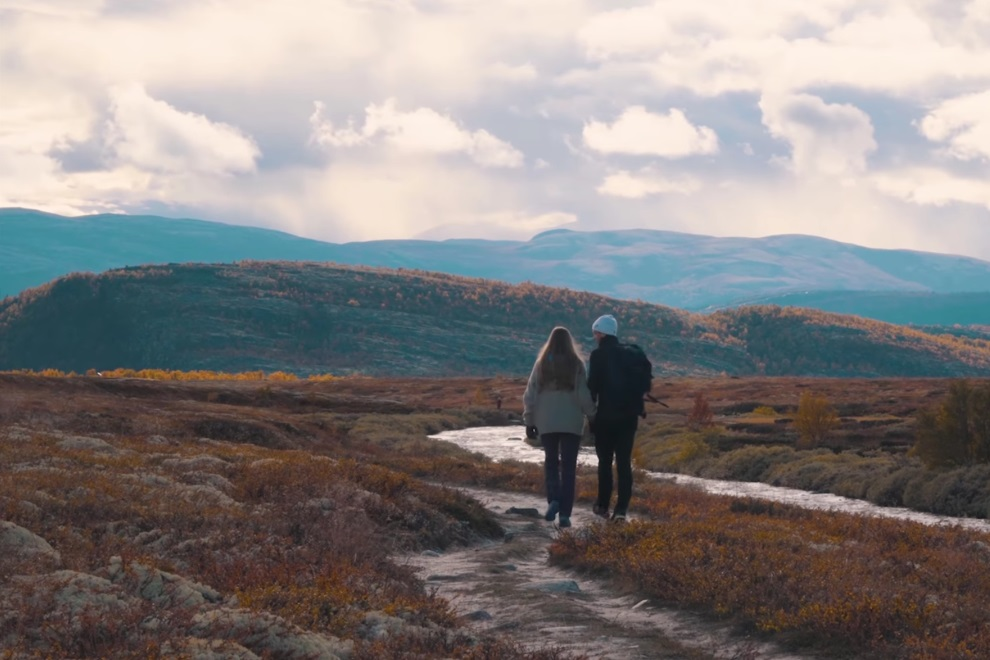

Vi har så langt ikke funnet én fjellturist som ikke har sagt at de enten har gått i Rondane og gjerne gjør det igjen, fordi det er så vakkert eller som sider at de ikke har vært der, men har det på lista.

- Som fjellområde er det det perfekte utgangspunkt for fotturer, både fordi man kan gå langs grusvei, fordi man har ti topper over 2.000 meter å bryne seg på, men også fordi området består av vakker, urørt natur. Rondane var Norges første nasjonalpark. Rett utenfor nasjonalparken ligger Furusjøen, hvor Rondane Høyfjellshotell låner ut gratis kanoer og hvor det er bademuligheter. Skiterrenget i Rondane byr på både fjelløyper og løyper i småskog som ligger i le for vinden. Skisesongen varer helt fra midten av november til slutten av april.

<Sidefelt>

</Sidefelt>
