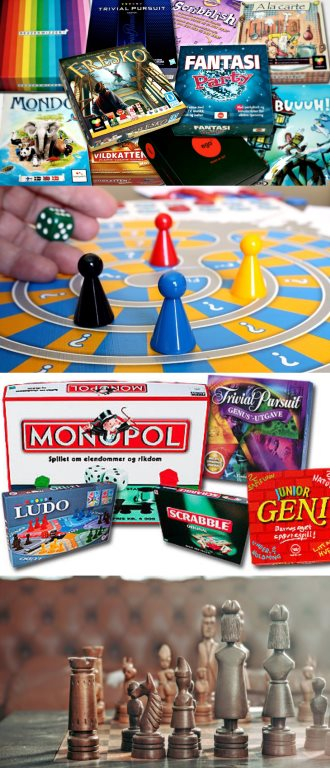

Hva gjør man på hytta når været er elendig? Man spiller brettspill og Yatzy. Men det er begrenset hvor mange spill en vanlig familie kan kjøpe inn. Et hotell derimot…

Hos Rondane Høyfjellshotell finner du brettspill nok til å ikke gå lei på et par uker! Alt kan lånes gratis i resepsjonen, mot et lite depositum, og et løfte om at du ikke spiser opp noen brikker. Så langt har vi kjøpt inn:

- Den forsvunne diamanten
- Ticket to Ride USA
- Ticket to Ride Scandinavia
- Yatzy
- Damm
- Kinasjakk
- Mikado
- Scrabble
- Sjakk
- Ludo
- Stigespill
- 4 på rad
- Domino
- Backgammon

<Sidefelt>

</Sidefelt>
