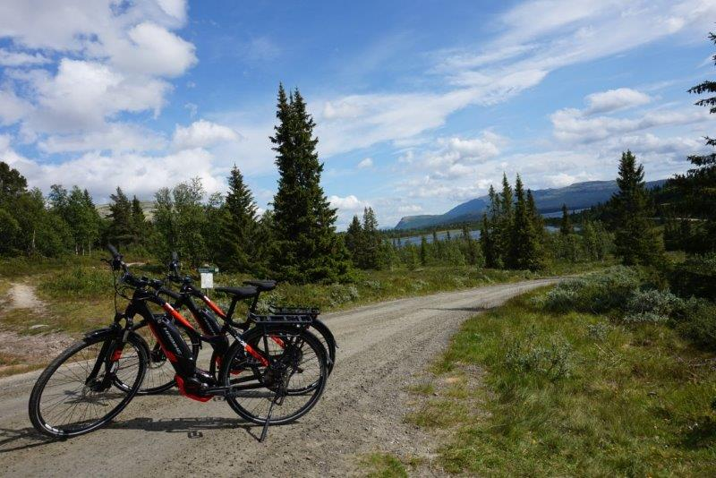
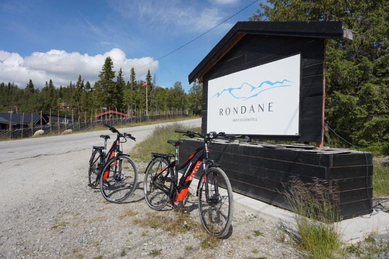
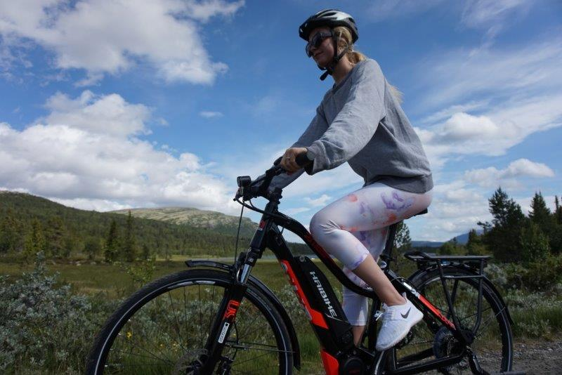

Cathrine Hoelseth og ektemannen David Krygier-Baum, som er fra Canada, var de første som leide våre nye el-sykler på Rondane Høyfjellshotell. De var fulle av lovord etter en tur til Furusjøen.

 - Vi hadde aldri forsøkt el-sykkel før, og var overrasket over hvor enkelt det var. Det var opplagt det lille ekstra krydderet som skulle til for å gjøre oppholdet enda litt bedre, sier David.

Ekteparet hadde bare to døgn overnatting og én turdag til rådighet,  og ville få mest mulig ut av oppholdet. Etter en gåtur til Peer Gynt-hytta, en tur på nesten to mil, ønsket de å se Furusjøen sammen dag. Den turen var gjort unna på ett kvarter. Vanligvis ville det tatt minst dobbelt så lang tid med ordinær sykkel.

- Jeg fikk høre på forhånd at man skal være litt forsiktig på grusveier, fordi el-sykler kan gi høy fart, men opplevde det ikke som noe problem, sier David. Han har blitt en sann Rondane-venn, etter å ha vært på hotellet for andre gang på ett år. Dette til tross for at også Canada byr på mye flott natur.

- Jeg føler at el-sykkeltilbudet er med å forsterke produktet Rondane Høyfjellshotell. Elektrisitet, urørt natur og det faktum at dere har et eget vannkraftverk, er jo veldig positivt, sier Cathrine.

- El-syklene hotellet leier ut er av merket Haibike Trekking 2.0  og koster nesten  30.000. Syklene har en rekkevidde på syv til ti mil, avhengig av tyngde på syklist og terreng.
- Det kommer til å bli rift om disse syklene og du skal ha flaks om du får leid dem uten å ha bestilt på forhånd. Ring oss på tlf. [61 20 90 90](tel:+4761209090), send oss e-post på [booking@rondane.no](mailto:booking@rondane.no) eller bestill direkte på Visbook.

<Sidefelt>

</Sidefelt>
