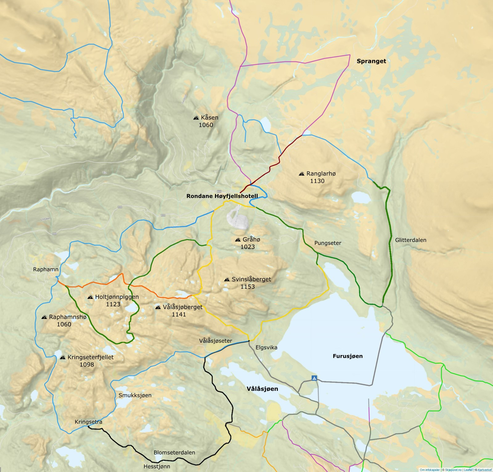

Rondane Høyfjellshotell er omgitt av skiløyper i et fantastisk vakkert landskap. Og mulighetene i skisporet er tilnærmet uendelige.

- Her finnes både høyfjellsløyper, løyper i et variert skogs- og fjellandskap, samt relativt flate løyper for nybegynnere på ski. Mange av våre sprekeste gjester tar også med seg randonée-ski på ryggen og bruker høyfjellshotellet som et utgangspunkt for toppturer.
- Godt preparerte skispor starter rett utenfor døra, og sesongen varer normalt fra tidlig november til et stykke ut i mai.
- Vi har forsøkt å gjøre det så enkelt som mulig for alle - inkludert deg som knapt har vært i fjellet før - å gå skiturer med Rondane Høyfjellshotell som utgangspunkt. Derfor har vi laget ferdige PDF-kart med løypebeskrivelse til alle våre gjester. I resepsjonen får du disse ferdig laminert.

<Sidefelt>

- [Løype 1 - Vålåsjøseter](/dokumenter/loype-1-vinterkort.pdf)
- [Løype 2 - Blomseterdalen](/dokumenter/loype-2-vinterkort.pdf)
- [Løype 3 - Kringseter](/dokumenter/loype-3-vinterkort.pdf)
- [Løype 4 - Glitterdalen](/dokumenter/loype-4-vinterkort.pdf)
- [Løype 5 - Raphamn](/dokumenter/loype-5-vinterkort.pdf)
- [Løype 6 - Hotel Rondablikk](/dokumenter/loype-6-vinterkort.pdf)
- [Løype 7 - Høvringen](/dokumenter/loype-7-vinterkort.pdf)
- [Løype 8 - Peer Gynt](/dokumenter/loype-8-vinterkort.pdf)
- [Løype 9 - Furusjøen rundt](/dokumenter/loype-9-vinterkort.pdf)

</Sidefelt>
