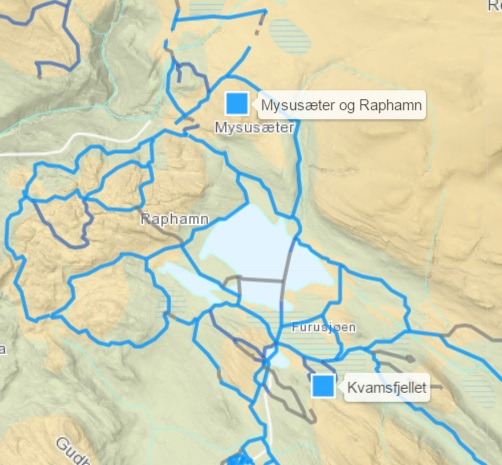
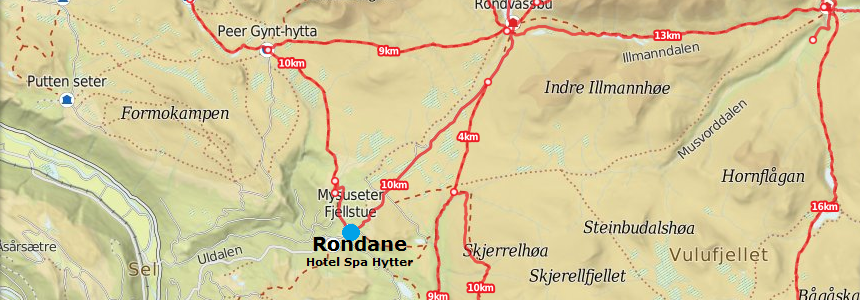

Vi kan by på spennende skiterreng som strekker seg mange mil inn i Rondane og i landskapet rundt. Terrenget er variert – fra høyfjell til tett skog og vann.

- Løypelaget på Mysuseter gjør en fantastisk innsats hvert år for å lage løyper i området med en relativt nyinnkjøpt løypemaskin. Hver dag kan du følge hvor løypene er nyoppkjørt på web.

- Variasjonen på løypelengde er stor. Her finner du løyper helt ned til 2,5 kilometer til over ti og kan kombinere disse ut fra form og lyst. Det beste av alt er den lange skisesongen. De sisite 10 årene har skiløypene blitt kjørt opp allerede i november.

<Sidefelt>

Fullstendig Løypeoversikt fra Løypelaget:
[www.skisporet.no](https://skisporet.no/destination/mysusaeterographamn)

</Sidefelt>
